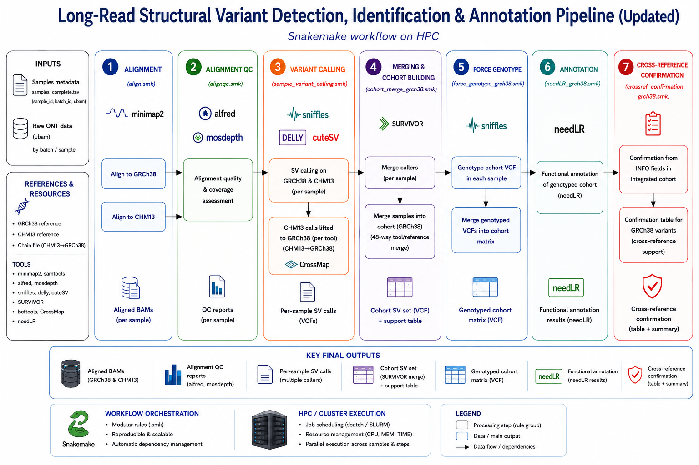

# StructuralVarAnnotation

Snakemake-based pipeline for long-read structural variant discovery, annotation, cross-reference confirmation and QC reporting.

The workflow is designed for HPC execution and supports end-to-end analysis from alignment to final annotated cohort-level structural variant results.

## Overview



StructuralVarAnnotation performs:

1. Alignment against GRCh38 and CHM13
2. Alignment quality control
3. Per-sample structural variant calling
4. CHM13-to-GRCh38 liftover
5. Integrated GRCh38 cohort merging
6. Force-genotyping
7. needLR annotation
8. Cross-reference confirmation from integrated GRCh38 INFO fields
9. Final QC and HTML report generation


Repository structure:

```
.
|-- workflow_master.smk                  # Full workflow run
|-- align.smk                            # Alignment workflow
|-- alignqc.smk	                         # Alignment QC workflow
|-- config-example.yml                   # Example config containing references and parameters
|-- alignqc_env.yml                      # Conda environment for QC
|-- sample.example.tsv                   # Example sample sheet
|-- Pipeline_overview.png
|-- bin/
|  |-- StructuralVarAnnotation           # Main command-line wrapper
| 
|-- variant_calling/                     # Variant calling module
|  |-- add_toolref_support_info.py       # Script to add tool-reference support field
|  |-- delly_to_symbolic.py              # Script to adapt delly output to vcf standard
|  |-- fix_genotype_header.py            # Script to fix sniffles genotyped header vcf
|  |-- sample_variant_calling.smk        # Per-sample SV calling
|  |-- cohort_merge_grch38.smk           # GRCh38 cohort merging
|  |-- force_genotype_grch38.smk         # Force-genotyping
|  |-- needLR_grch38.smk                 # needLR annotation
|  |-- crossref_confirmation_grch38.smk  # CHM13 -> GRCh38 confirmation
|  |-- qc_report_generator.smk           # Full report build
|  |-- envs/                             # Conda environments dependencies
|  |-- container/
|
|-- README.md
```

## Workflow Description

### Alignment

Reads are aligned againts both:

- GRCh38
- CHM13 (T2T)

This dual-reference design allows structural variant discovery in both reference spaces and enables cross-reference comparison after CHM13 calls are lifted to GRCh38.

### Alignment QC 

Alignment Quality Control is generated using:

- Alfred
- Mosdepth

### Structural Variant Calling

Per-sample structural variants are called using:

- Sniffles2
- CuteSV
- Delly long-read mode

### Liftover

Variants are lifted from CHM13 to GRCh38 using CrossMap.
This allows the confirmation of variants identified on both references.

### Force-Genotyping

All the variants are force called to genotype the samples for all of them.

### Annotation

Variants are annotated using needLR and confirmed using INFO fields of vcf.

### Final QC report

The workflow generates a complete HTML QC report combining:

- Run overview
- Read QC with NanoPlot/FASTQC
- Alignment QC
- Cohort construction summary
- Tool/reference UpSet plots
- needLR annotation plots
- needLR population frequency plots
- GRCh38/CHM13 confirmation plots 

## Requirements

- Conda/Mamba
- Snakemake >= 7.32.4

These are the only requirements since the environments and tools used are built automatically when needed.

## Installation

Clone the repository

```bash
git clone https://github.com/GautieriGiuseppe/StructuralVarAnnotation
cd StructuralVarAnnotation
```

Create or activate a Snakemake environment. For example:

```bash
conda activate snakemake_env
```

Make the launcher executable:

```bash
chmod +x bin/StructuralVarAnnotation
```

### Configuration

Copy and modify the config and sample sheet:

```bash
cp config-example.yml config.yml
cp samples.example.tsv samples.tsv
```

The values of samples and output can be overridden from command line with --samples and --outdir.

### Local Usage

Dry run:
```bash
bin/StructuralVarAnnotation \
    --samples samples.tsv \
    --outdir results/test_run \
    --dry-run
```

Run using a custom config:
```bash
bin/StructuralVarAnnotation \
  --samples /path/to/samples.tsv \
  --outdir /path/to/results/run_name \
  --config /path/to/config.yml \
  --jobs 200 
```

### SLURM Usage

Run controller in current shell, submit everything with one command:
```bash
bin/StructuralVarAnnotation \
  --samples samples.tsv \
  --config config.yml \
  --outdir results/ \
  --jobs 150 \
  --slurm
```

samples tsv file example:

```
sample_id	ubam	summary	fastq	batch_id
A_1	/path/to/A_1.ubam	/path/to/A_1_sequencing_summary.tsv.gz	/path/to/A_1.fastq.gz	1
A_2	/path/to/A_2.ubam	/path/to/A_2_sequencing_summary.tsv.gz	/path/to/A_2.fastq.gz	1
A_3	/path/tp/A_3.ubam	/path/to/A_3_sequencing_summary.tsv.gz	/path/to/A_3.fastq.gz	1
```
